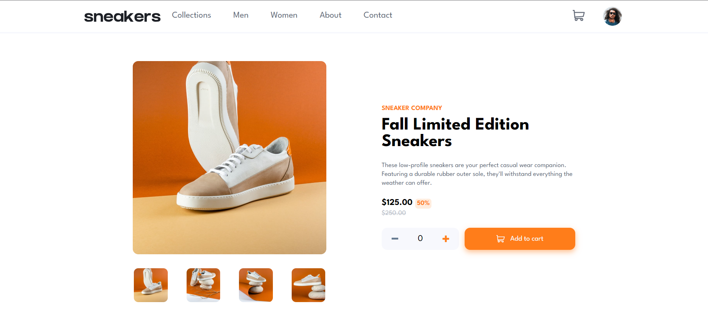

# Frontend Mentor - E-commerce product page solution

This is a solution to the [E-commerce product page challenge on Frontend Mentor](https://www.frontendmentor.io/challenges/ecommerce-product-page-UPsZ9MJp6). Frontend Mentor challenges help you improve your coding skills by building realistic projects.

## Table of contents

- [Overview](#overview)
  - [The challenge](#the-challenge)
  - [Screenshot](#screenshot)
  - [Links](#links)
- [My process](#my-process)
  - [Built with](#built-with)
  - [Continued development](#continued-development)
  - [Useful resources](#useful-resources)
- [Author](#author)

## Overview

### The challenge

Users should be able to:

- View the optimal layout for the site depending on their device's screen size
- See hover states for all interactive elements on the page
- Open a lightbox gallery by clicking on the thumbnail product image
- Switch the large product image by clicking on the small thumbnail images
- Add items to the cart
- View the cart and remove items from it

### Screenshot

<div>
    <h5>Desktop: </h5>
    
</div>
<div>
    <h5>Mobile: </h5>
    
</div>


### Links

- Solution URL: [https://www.frontendmentor.io/solutions/responsive-ecommerce-product-page-using-reactjs-sass-and-swiperjs-oNlex8cPGT](https://www.frontendmentor.io/solutions/responsive-ecommerce-product-page-using-reactjs-sass-and-swiperjs-oNlex8cPGT)
- Live Site URL: [https://nicoleyry-ecommerce-product-page.netlify.app/](https://nicoleyry-ecommerce-product-page.netlify.app/)

## My process

### Built with

- Semantic HTML5 markup
- CSS custom properties
- Flexbox
- CSS Grid
- Mobile-first workflow
- [React](https://reactjs.org/) - JS library
- [SASS](https://sass-lang.com/) - For styles
- [Swiper](https://swiperjs.com/) - For lightbox

### Continued development

- Since at this moment, all the options on the menu only 'cart' option works. I'd really love to make all the other options work as well. (Collections, About, Contact... )
- The product data is now hardcoded in the App.js. 
	```js
	let product = {
		stock: 10,
		price: {
			originalPrice: formatPrice(250),
			discount: 50,
			finalPrice: formatPrice(125),
		}
	};
	```
	But I'd like to call the API to make the page more dynamic. I've found this [dummy JSON](https://dummyjson.com/docs/products) to use.


## Author

- Website - [Nicole Yang](https://www.nicoleyry.com/)
- Frontend Mentor - [@nicoleyry](https://www.frontendmentor.io/profile/nicoleyry)
- Twitter - [@nicoleyry](https://twitter.com/nicoleyry)
